# 🤖 n8n Automation Assistant

> Transform natural language into production-ready n8n workflows with AI-powered automation


[](https://www.docker.com/)
[](https://www.python.org/)
[](https://openai.com/)

---

##  What is this?

The **n8n Automation Assistant** is your AI-powered workflow companion that converts plain English descriptions into fully functional n8n automations. No more manual node configuration – just describe what you want, and watch your workflow come to life!


##  Key Features

<table>
<tr>
<td width="50%">

###  **AI-Powered Generation**
- Natural language → Working n8n workflow
- Powered by OpenAI's latest models
- Smart node selection and configuration

###  **Built-in Safety**
- Content moderation and validation
- Custom guardrails for secure workflows
- Schema validation for all nodes

</td>
<td width="50%">

###  **Production Ready**
- Full Docker containerization
- Prometheus metrics integration
- CI/CD pipeline included

###  **Developer Friendly**
- Modular architecture
- Comprehensive test coverage
- Easy customization and extension

</td>
</tr>
</table>

---

##  Architecture Overview

```mermaid
graph TD
    A[👤 User Prompt] --> B[🧠 LLM Parser]
    B --> C[🔨 Workflow Builder]
    B --> D[🛡️ Guardrails]
    C --> E[📊 n8n API]
    D --> F[📈 Metrics]
    E --> G[✅ Ready Workflow]
    
    style A fill:#e1f5fe
    style B fill:#f3e5f5
    style C fill:#e8f5e8
    style D fill:#fff3e0
    style E fill:#fce4ec
    style F fill:#f1f8e9
    style G fill:#e0f2f1
```



---

##  Quick Start

### Prerequisites
- Docker & Docker Compose
- OpenAI API key
- n8n instance (local or remote)

### 1️⃣ Clone the Repository
```bash
git clone https://github.com/yourusername/automation-assistant.git
cd automation-assistant
```

### 2️⃣ Configure Environment
```bash
cp .env.example .env
# Edit .env with your settings
```

Required environment variables:
```env
N8N_API_URL=http://n8n:5678
N8N_USER_EMAIL=your@n8n.email
N8N_USER_PASSWORD=yourpassword
OPENAI_API_KEY=sk-your-openai-key
PROMPT=Every Monday at 10:00 AM, send me a summary of unread Gmail emails.
```

### 3️⃣ Launch with Docker
```bash
docker-compose up --build
```

### 4️⃣ Access Your Tools
- 🎯 **n8n Interface**: http://localhost:5678
- 📊 **Metrics Dashboard**: http://localhost:8001/metrics

---

## 💡 Usage Examples

### 📧 Email Automation
```
"Every weekday at 9 AM, check for new emails with 'urgent' in the subject and send a Slack notification"
```

### 📱 Social Media Management
```
"Post my latest blog articles to Twitter and LinkedIn whenever I publish them on my website"
```

### 📈 Data Processing
```
"Download sales data from Google Sheets every hour and update our CRM with new leads"
```

### 🔄 System Integration
```
"When a new customer signs up, create a Trello card, send a welcome email, and add them to our newsletter"
```

---

## 🧩 Project Structure

```
automation_assistant/
├── 📁 automation_assistant/
│   ├── 🐍 main.py              # CLI entrypoint
│   ├── 📝 prompts.py           # Prompt templates & node configs
│   ├── 🛡️ guardrails.py        # Safety checks & metrics
│   ├── 🔨 workflow_builder.py  # n8n workflow construction
│   ├── 🧠 llm_parser.py        # LLM communication logic
│   └── 🧪 tests/               # Comprehensive test suite
├── 🐳 docker-compose.yaml      # Container orchestration
├── 📦 Dockerfile               # Application container
├── ⚙️ .env.example             # Environment template
└── 📚 README.md                # This beautiful file!
```

---

## 🛡️ Security & Validation

### Multi-Layer Protection
- **🔍 OpenAI Moderation**: Automatic content safety screening
- **✅ Custom Validators**: Configurable business rule enforcement
- **🔒 Schema Validation**: Ensures workflow integrity
- **📊 Audit Logging**: Complete operation traceability

### Customizable Guardrails
```python
# Example: Add custom validation rules
def custom_validator(prompt: str) -> bool:
    forbidden_words = ['delete_all', 'drop_table']
    return not any(word in prompt.lower() for word in forbidden_words)
```

---

## 📊 Monitoring & Metrics

Built-in Prometheus metrics tracking:

| Metric | Description |
|--------|-------------|
| `workflow_generation_duration` | Time to generate workflows |
| `llm_request_latency` | LLM API response times |
| `validation_checks_total` | Number of validation runs |
| `failed_workflows_total` | Failed generation attempts |

### Custom Metrics Dashboard
```bash
# View metrics endpoint
curl http://localhost:8001/metrics
```

---

## 🧪 Development & Testing

### Local Development Setup
```bash
# Install dependencies
poetry install

# Run tests
pytest

# Run with coverage
pytest --cov=automation_assistant

# Lint code
flake8 automation_assistant/
black automation_assistant/
```

### Adding New Features
1. **New Node Types**: Update `prompts.py` with node templates
2. **Custom Guardrails**: Extend `guardrails.py` validation logic
3. **LLM Providers**: Add new clients in `llm_parser.py`

---

## 🔧 Configuration

### Environment Variables

| Variable | Description | Default |
|----------|-------------|---------|
| `N8N_API_URL` | n8n instance URL | `http://n8n:5678` |
| `N8N_USER_EMAIL` | n8n login email | Required |
| `N8N_USER_PASSWORD` | n8n login password | Required |
| `OPENAI_API_KEY` | OpenAI API key | Required |
| `PROMPT` | Default workflow description | Optional |
| `METRICS_PORT` | Prometheus metrics port | `8001` |
| `LOG_LEVEL` | Logging verbosity | `INFO` |

### Advanced Configuration
```python
# prompts.py - Customize LLM behavior
SYSTEM_PROMPT = """
You are an expert n8n workflow designer.
Create efficient, production-ready automations.
Focus on error handling and maintainability.
"""
```

---

## 🚀 Deployment

### Docker Production Deployment
```yaml
# docker-compose.prod.yml
version: '3.8'
services:
  automation-assistant:
    build: .
    environment:
      - LOG_LEVEL=WARNING
      - METRICS_PORT=8001
    restart: unless-stopped
    networks:
      - production
```

### Kubernetes Deployment
```yaml
apiVersion: apps/v1
kind: Deployment
metadata:
  name: automation-assistant
spec:
  replicas: 3
  selector:
    matchLabels:
      app: automation-assistant
  template:
    spec:
      containers:
      - name: assistant
        image: automation-assistant:latest
        ports:
        - containerPort: 8001
```

---

## 🤝 Contributing

We welcome contributions! Here's how to get started:

1. **🍴 Fork** the repository
2. **🌟 Create** a feature branch (`git checkout -b feature/amazing-feature`)
3. **💻 Commit** your changes (`git commit -m 'Add amazing feature'`)
4. **📤 Push** to the branch (`git push origin feature/amazing-feature`)
5. **🔄 Open** a Pull Request

### Development Guidelines
- Follow PEP 8 style guide
- Add tests for new features
- Update documentation
- Use conventional commits

---

## 📋 Roadmap

- [ ] 🌐 **Web Interface** - Beautiful UI for workflow generation
- [ ] 🤖 **Multi-LLM Support** - Claude, Ollama, and more
- [ ] 🔌 **Plugin System** - Extensible node library
- [ ] 📱 **Mobile App** - iOS/Android workflow management
- [ ] 🔄 **Workflow Templates** - Pre-built automation library
- [ ] 🎯 **Smart Suggestions** - AI-powered workflow optimization
- [ ] 📊 **Analytics Dashboard** - Usage insights and performance metrics

---

## ❓ FAQ

<details>
<summary><strong>🤔 How accurate are the generated workflows?</strong></summary>

The assistant uses advanced prompt engineering and validation to ensure high accuracy. Most workflows work immediately, with complex scenarios requiring minor adjustments.
</details>

<details>
<summary><strong>🔧 Can I customize the node templates?</strong></summary>

Absolutely! Edit `prompts.py` to modify existing templates or add new ones. The system is designed to be highly customizable.
</details>

<details>
<summary><strong>🌐 Does it work with n8n Cloud?</strong></summary>

Yes! Just update your `N8N_API_URL` to point to your n8n Cloud instance and provide the appropriate credentials.
</details>

<details>
<summary><strong>💰 What are the costs?</strong></summary>

The main cost is OpenAI API usage. Typical workflow generation uses $0.01-0.05 per request, depending on complexity.
</details>

---


---

## 👨‍💻 Author

**Artem Shishkin**
- GitHub: [@ArtemShishkin](https://github.com/ashishki)
- LinkedIn: [Artem Shishkin](https://linkedin.com/in/ashishki)

---

<div align="center">

### 🌟 Star this project if you find it useful!

[⭐ Give it a star](https://github.com/ashishki/automation-assistant) • [🐛 Report bug](https://github.com/ahishki/automation-assistant/issues) • [💡 Request feature](https://github.com/ashishki/automation-assistant/issues)

---

**Made with ❤️ and lots of ☕**

</div>